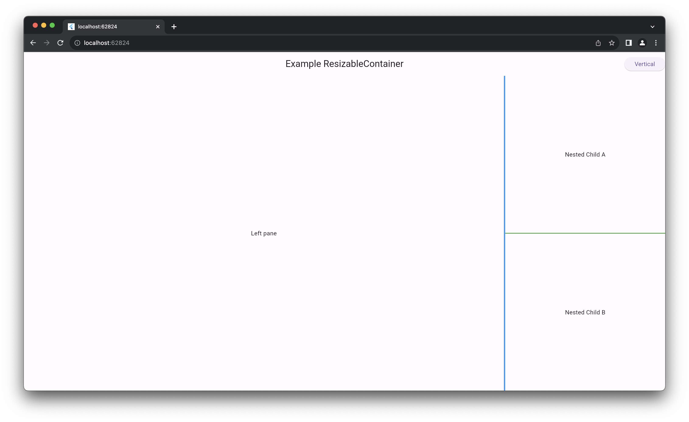

# Flutter Resizable Container

Add flexibility and interaction to your UI with ease.

View the interactive example app at [andyhorn.github.io/flutter_resizable_container](https://andyhorn.github.io/flutter_resizable_container)



## Features

* `ResizableContainer`s are fully nestable
* Customize the size/thickness, indentation, and color of the dividers between children
* Respond to user interactions with `onHoverEnter` and `onHoverExit` callbacks on dividers
* Programmatically set the ratios of the resizable children through a `ResizableController`
* Respond to changes in the sizes of the resizable children by listening to the `ResizableController`

## Getting started

Add this package to your `pubspec.yaml` or install using the command line.

```dart
flutter pub add flutter_resizable_container
```

## Usage

### Direction

Add a `ResizableContainer` to your widget tree and give it a `direction` of type `Axis` - this is the direction in which the `children` will be laid out and the direction in which their size will be allowed to flex.

```dart
ResizableContainer(
  ...
  direction: Axis.horizontal,
  ...
)
```

In the example above, any children (more on this in the [ResizableChild](#resizable-child) section) will take up the maximum available height while being allowed to flex their width by dragging a divider or updating their ratios via the controller (see below).

### ResizableController

#### Setup

Second, add a `ResizableController`. This controller is used to respond to resize events and calculate the size of each child widget.

For example:

```dart
ResizableContainer(
    controller: ResizableController(),
),
```

#### Using a ResizableController

If you retain a reference to the `ResizableController`, you can listen to its changes as well as programmatically set/reset the `ratios` of the container's children.

```dart
final controller = ResizableController();

@override
void initState() {
    super.initState();

    controller.addListener(() {
        // ... react to size change events
        final sizes = controller.sizes;
        print(sizes.join(', '));
    });
}

@override
void dispose() {
    controller.dispose(); // don't forget to dispose your controller
    super.dispose();
}

// (somewhere else in your code)
// use the ratios setter to programmatically set the ratios of the 
// container's children.
onTap: () => controller.ratios = [0.25, 0.25, 0.5];
```

### ResizableChild

To add widgets to your container, you must provide a `List<ResizableChild>`, each of which contain the child `Widget` as well as some configuration parameters.

```dart
children: [
    if (showNavBar) ...[
        ResizableChild(
            maxSize: 350.0,
            child: NavBarWidget(),
        ),
    ],
    const ResizableChild(
        expand: true,
        startingRatio: 0.75,
        child: BodyWidget(),
    ),
    if (showSidePanel) ...[
        ResizableChild(
            minSize: 100,
            child: SidePanelWidget(),
        ),
    ],
],
```

In the example above, there are three `Widget`s added to the screen, two of which can be hidden based on state.

The first child, containing the `NavBarWidget`, has a maximum size of 350.0.
The second child, containing the `BodyWidget`, is set to automatically expand and has a starting ratio of 0.75.
The third child, containing the `SidePanelWidget`, is set to _not_ expand and has a minimum size of 100.0.

The `maxSize` parameter constrains the child and will prevent it from being expanded beyond that size in the `direction` of the container.

The `minSize` parameter constrains the child and will prevent it from being _shrunk_ beyond that size in the `direction` of the container.

The `startingRatio` parameter gives a directive of how to size the child during its initial layout. If this value is `null`, any remaining available space will be distributed evenly to this child and other children with `null` ratios.
    - In this example, since the `NavBarWidget` and `SidePanelWidget` both have `null` ratios, the remaining available space (1.0 - 0.75 = 0.25) will be distributed evenly between them (0.25 / 2 = 0.125).

The `expand` flag is used to control whether the child will be expanded to fill remaining available space, ignoring the `startingRatio` constraint. 
    - Note: If there are children with `null` ratios, they will be given the remaining available space - this flag only affects the layout if the child has a valid `startingRatio` _and_ there are no other children with a `startingRatio` of `null`.
    - In this example, if both of the other children are hidden, the `BodyWidget` will be expanded to the full available space. 

If the state changes and one or more child widgets are added or removed, the children will be re-laid out according to all of these parameters.

### ResizableDivider

Use the `ResizableDivider` class to customize the look and feel of the dividers between each of a container's children.

You can customize the `thickness`, `size`, `indent`, `endIndent`, and `color` of the divider. You can also provide callbacks for the `onHoverEnter` and `onHoverExit` events to respond to user interactions.

```dart
divider: ResizableDivider(
    thickness: 2,
    size: 5,
    indent: 5,
    endIndent: 5,
    onHoverEnter: () => setState(() => hovered = true),
    onHoverExit: () => setState(() => hovered = false),
    color: hovered ? Colors.blue : Colors.black,
),
```

## License

Copyright 2023-2024 Andrew Horn

Permission is hereby granted, free of charge, to any person obtaining a copy of this software and associated documentation files (the "Software"), to deal in the Software without restriction, including without limitation the rights to use, copy, modify, merge, publish, distribute, sublicense, and/or sell copies of the Software, and to permit persons to whom the Software is furnished to do so, subject to the following conditions:

The above copyright notice and this permission notice shall be included in all copies or substantial portions of the Software.

THE SOFTWARE IS PROVIDED "AS IS", WITHOUT WARRANTY OF ANY KIND, EXPRESS OR IMPLIED, INCLUDING BUT NOT LIMITED TO THE WARRANTIES OF MERCHANTABILITY, FITNESS FOR A PARTICULAR PURPOSE AND NONINFRINGEMENT. IN NO EVENT SHALL THE AUTHORS OR COPYRIGHT HOLDERS BE LIABLE FOR ANY CLAIM, DAMAGES OR OTHER LIABILITY, WHETHER IN AN ACTION OF CONTRACT, TORT OR OTHERWISE, ARISING FROM, OUT OF OR IN CONNECTION WITH THE SOFTWARE OR THE USE OR OTHER DEALINGS IN THE SOFTWARE.
